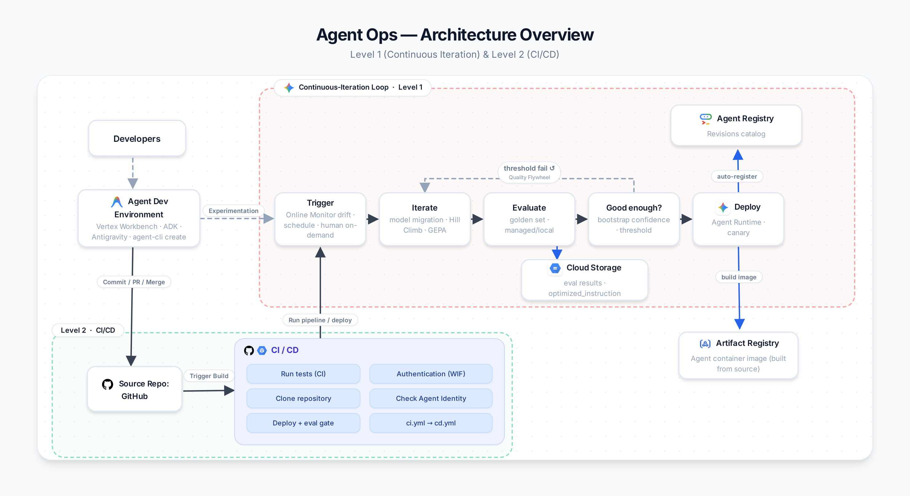

# Agent Ops Maturity on Google Cloud (L1 → L2)

This repo is a **baseline for operationalizing agent development** on Google Cloud, bringing **MLOps foundations** to the agent life cycle. It demonstrates **Agent Ops maturity** in two levels: 
* **Level 1 (Continuous Iteration)**, the MLOps improve/deploy loop
* **Level 2 (CI/CD pipeline automation)**, the DevOps delivery pipeline on the Gemini Enterprise Agent Platform (GEAP) with ADK

Each agent lives in its own folder under `agents/` (managed in Agent Registry), so every agent is iterated, evaluated, and monitored independently. The shared engine includes the loop feedback, the eval threshold check, the deployment. This stays central and is pointed at an agent with `--agent-dir`. Add an agent by adding a folder; Terraform discovers it automatically.

The example agent(**retail brand-guidelines checker**) consists of a single-turn, no tools, and structured JSON output. This is a simple example to demonstrate the maturity base scaffolding; [future work](#future-work) is planned for more complex agent examples.

## The Flow




L1 wraps Google's Quality Flywheel (*evaluate → analyze → optimize*, the `hill climb` step) with the operational pieces that earn the Continuous Training label: a production trigger, a threshold check, and a canary deploy into staging. 

Level 2 adds CI/CD around the agent code: a PR runs tests (CI), then builds and deploys (CD), staging automatically and production behind a manual approval.

## Getting started

**0. Clone this code repository in your user environment**

Two independent paths set up the same platform — pick one:
- **Terraform (automated)** — stand up the whole platform as IaC.
- **Notebooks (learning)** — step through each Agent Ops stage by hand.

Config has two layers both Terraform and the runtime scripts read, so they never drift: `configs/defaults.yaml` (project id/region + global fallbacks + the CI/CD repo) and each `agents/<name>/agent.yaml` (that agent's model, eval policy, monitor thresholds, canary %).

### Path A — Terraform (automated)

L1 platform — `terraform/` declares it as code (APIs, SA + IAM, artifact bucket, log-based Final Response Quality metric, drift alert, dashboard, Pub/Sub trigger bus, scheduled-eval job). The managed agent deploy and the Preview online monitor are gated OFF by default.

```bash
cd terraform
cp terraform.tfvars.example terraform.tfvars   # set project_id
terraform init && terraform apply
terraform apply -var deploy_agent=true         # when ready to deploy the agent
```

L2 CI/CD infra — the separate `cicd/` folder (keyless WIF + Artifact Registry). It also generates `.github/workflows/pipeline.yml` from this project's values. See `cicd/README.md`.

```bash
terraform -chdir=cicd apply                    # WIF + Artifact Registry + the PR pipeline
```

### Path B — Notebooks (learning)

Each notebook provisions the services it needs and demonstrates one Agent Ops step. This is the imperative twin of Path A — you do **not** need to run Terraform first.

#### L1 — Continuous Iteration (includes the Quality Flywheel)

**1. Deploy the agent**

* [01-deploy-agent.ipynb](./notebooks/01-deploy-agent.ipynb) : Deploys the example agent onto the managed Agent Runtime as a container built from source. Doubles as the telemetry-wiring check (Cloud Trace, Cloud Logging, Agent Identity) and auto-registers the revision in Agent Registry. (`01b-deploy-agent-pickle-WIP.ipynb` is the legacy pickle-deploy variant, out of sequence.)

**2. Continuous evaluation**

* [02-continuous-evaluation.ipynb](./notebooks/02-continuous-evaluation.ipynb) : Scores the deployed agent against the golden evalset with a console-tracked managed evaluation run (a custom Final Response Quality rubric + predefined Safety + General Quality), and describes the online monitor over live traffic.

**3. Feedback loop trigger**

* [03-feedback-loop-trigger.ipynb](./notebooks/03-feedback-loop-trigger.ipynb) : Runs the L1 loop — trigger → model migration → hill climb (GEPA) → good enough? → deploy — recovering quality after drift and canarying the winner into staging.

**4. Canary rollback**

* [04-canary-rollback.ipynb](./notebooks/04-canary-rollback.ipynb) : The protect half of the loop — roll back a regressed revision by shifting traffic to the previous one (manual + runnable; automated rollback described). Protects staging only.

#### L2 — CI/CD

**5. CI — automated tests (Level 2)**

* [05-ci-tests.ipynb](./notebooks/05-ci-tests.ipynb) : Writes and runs the test suite (Central + Agent-specific) that the reusable `ci.yml` GitHub Actions workflow runs on every PR. No cloud credentials needed.

**6. CD — build & deploy pipeline (Level 2)**

* [06-cd-pipeline.ipynb](./notebooks/06-cd-pipeline.ipynb) : Provisions the keyless CI/CD infra (`cicd/` Terraform: WIF + Artifact Registry) and generates `pipeline.yml`, which runs `ci.yml → cd.yml` on a PR — staging auto, production manual.

#### Cleanup

**7. Teardown**

* [07-teardown.ipynb](./notebooks/07-teardown.ipynb) : Tears down everything NB1–06 created (the agent, observability, the L2 CI/CD infra, and GCS buckets).

## Prerequisites

Ensure the project environment, network settings, and service accounts used have the appropriate Google Cloud authentication and permissions to access the following services:
- `GEAP` (Agent Engine / Agent Runtime)
- `Cloud Storage`
- `Artifact Registry`
- `Cloud Logging` & `Cloud Monitoring`
- `Pub/Sub`
- `Cloud Functions`
- `IAM` (Workload Identity Federation, for the L2 CI/CD path)

Local tooling: `gcloud` (with Application Default Credentials), `terraform`, and — for the L2 CI/CD path — the GitHub CLI `gh`. Install `requirements-dev.txt` to run the tests locally.

## Add an agent

The repo scales by folders. Each agent is an **agents-cli project** (the official `app/` structure + deploy) with our **maturity layer** (`eval/`, `observability/`, `agent.yaml`) on top. See [`agents/README.md`](./agents/README.md) for the two BYOA paths in detail. To onboard one:

1. **Scaffold the structure with agents-cli:** `agents-cli create <name> -o agents/ -a adk -d agent_runtime --cicd-runner skip --prototype` → writes `agents/<name>/app/agent.py` + `agents-cli-manifest.yaml` + `pyproject.toml`. Set `region: us-central1` in the manifest. Folder name is kebab-case, ≤ 30 chars.
2. **Layer the maturity bits** (copy from `brand-guidelines-checker/` and adapt): `agent.yaml`, `eval/{golden.evalset.json, criteria.json, weak_instruction.txt}`, `observability/{metric,alert,canary_alert,monitor}.yaml` + `dashboard.json`.
3. Re-run `terraform apply` — `terraform/main.tf` discovers the folder via `fileset()` and instantiates the `agent_ops` module for it (its own SA, bucket, metric, alert, trigger topic, dashboard).
4. Drive it with the shared engine by passing `--agent-dir agents/<name>` to `eval_tool/run_eval.py`, `loop/run_ct_loop.py`, and `deployment/deploy_agent.py` (deploy defaults to `agents-cli deploy`).

> Claude Code users: run **`/add-agent`** (or "follow `skills/add-agent.md`") to do steps 1–2 automatically.

## Repo folder structure

```bash
.
├── agents                                : One folder per agent (managed in Agent Registry); shared engine points here via --agent-dir.
│   └── brand-guidelines-checker          : The canonical L1 example agent (agents-cli `app/` shape + our maturity layer).
│       ├── app                           : agents-cli project — agent.py (root_agent + app), agent_runtime_app.py, app_utils/.
│       ├── agents-cli-manifest.yaml      : agents-cli deploy config (target, region).
│       ├── pyproject.toml                : agents-cli deps + eval extras.
│       ├── agent.yaml                    : OUR config (model, eval policy, monitor, canary).
│       ├── requirements.txt              : Agent runtime deps (legacy; pyproject is the agents-cli source).
│       ├── eval                          : This agent's test data.
│       │   ├── criteria.json             : Active eval criteria + thresholds.
│       │   ├── golden.evalset.json       : The golden evalset (regression cases).
│       │   └── weak_instruction.txt      : Deliberately weak instruction used to simulate drift.
│       └── observability                 : The detection half of the loop (per agent).
│           ├── metric.yaml               : Log-based metric (extracts Final Response Quality from logs).
│           ├── alert.yaml                : Drift alert — auto-trigger into the loop (improve path).
│           ├── canary_alert.yaml         : Canary-scoped breach alert — auto-trigger rollback (protect path).
│           ├── monitor.yaml              : Online monitor spec (live-traffic sample, same rater).
│           └── dashboard.json            : Quality + operational metrics overview.
├── terraform                             : Path A — L1 platform as IaC; discovers agents via fileset(), one module per agent.
│   └── modules/agent_ops                 : Per-agent ops stack (SA+IAM, bucket, metric, alert, trigger).
├── cicd                                  : L2 CI/CD infra (keyless WIF + Artifact Registry); renders pipeline.yml.
│   ├── wif.tf                            : Workload Identity Federation + deployer SA + Artifact Registry.
│   ├── pipeline.tf                       : Renders .github/workflows/pipeline.yml from the outputs.
│   ├── pipeline.yml.tftpl                : Template for the PR orchestrator (ci.yml → cd.yml).
│   └── README.md                         : One-time CI/CD setup runbook.
├── .github/workflows                     : Reusable GitHub Actions workflows.
│   ├── ci.yml                            : CI — lint + pytest (called on a PR).
│   └── cd.yml                            : CD — deploy → managed-eval gate → manual prod (called on a PR).
├── loop                                  : Shared loop driver (heart of L1) — pointed via --agent-dir.
│   ├── run_ct_loop.py                    : trigger → hill climb → evaluate → threshold → deploy.
│   ├── gepa_optimize.py                  : Prompt optimization candidate (ADK GEPA optimizer).
│   ├── hillclimb_prompt.py               : Lightweight prompt-optimization candidate.
│   ├── hillclimb_model.py                : Model-migration candidate (swap model=).
│   └── README.md                         : The loop runbook — how it runs + human-approval checklist + Preview caveats.
├── eval_tool                             : Shared "good enough?" threshold-check tool.
│   ├── run_eval.py                       : Scores an agent (--engine local=ADK | managed=GCP Agent Evaluation).
│   ├── managed_eval.py                   : GCP-native managed eval backend (run_inference + client.evals).
│   └── compare.py                        : Threshold check + bootstrap CI: candidate vs. live.
├── deployment                            : Shared deploy / register / rollback (also TF local-exec targets).
│   ├── deploy_agent.py                   : Deploy — default `agents-cli deploy`; `--source` in-repo builder; `--sdk` pickle (legacy).
│   ├── rollback.py                       : Revert traffic to the prior revision.
│   ├── teardown_agent.py                 : Tear down a deployed agent.
│   ├── loop_subscriber                   : Cloud Function — runs the loop on a drift message (improve path).
│   └── rollback_subscriber               : Cloud Function — auto-rolls-back a bad canary (protect path).
├── tests                                 : CI test suite (unit/mock; no cloud creds).
│   ├── test_framework.py                 : Central — framework code (parse_verdict, thresholds, rubric).
│   ├── test_agents.py                    : Central — generic contract over every agents/*/.
│   └── agents/test_brand_guidelines.py   : Agent-specific — the brand checker's own rules.
├── configs/defaults.yaml                 : Project settings + global fallbacks + cicd.github_repo.
├── notebooks                             : Path B — guided walkthroughs (01–07).
└── requirements-dev.txt                  : Dev/test dependencies (pytest, ruff, ...).
```

The split is **per-agent data/specs vs. shared engine**: an agent folder holds its source, config, golden set, and monitor specs; `loop/`, `eval_tool/`, and `deployment/` hold one copy of the engine every agent reuses. (Note the two senses of "eval": `eval_tool/` is the shared *threshold-check tool*; `agents/<name>/eval/` is that agent's *test data*.)

## Future work

The repo ships one example today (`brand-guidelines-checker` — single-turn, no tools). Planned examples extend it by agent **shape** — each lights up a different slice of the evaluation rater catalog and exercises the shared engine (`loop/`, `eval_tool/`, `deployment/`, `terraform/`) unchanged:
- **Tool-calling agents** — tool-use quality + trajectory raters (e.g. an order-status / returns assistant).
- **RAG agents** — retrieval grounding, with the hallucination / reference-based raters that need grounding context.
- **Multi-turn conversational agents** — Task Success (multi-turn, reference-free).
- **Agents with memory (Memory Bank)** — persistent long-term memory across sessions via GEAP Agent Engine Memory Bank; exercises recall/consistency evaluation and per-user personalization.
- **Multi-agent (A2A)** — agent-to-agent orchestration across several `agents/<name>/` folders.

Beyond more agent shapes, planned lifecycle work:
- **Integration & deployment to the Gemini Enterprise app** — publish the deployed agent into the Gemini Enterprise application so end users can discover and use it (e.g. `agents-cli publish gemini-enterprise`). Today the pipeline stops at Agent Runtime + Agent Registry; this closes the loop from build → ops → end-user access.

## References

* [Gemini Enterprise Agent Platform](https://docs.cloud.google.com/gemini-enterprise-agent-platform)
* [Deploy an agent](https://docs.cloud.google.com/gemini-enterprise-agent-platform/scale/runtime/deploy-an-agent) · [Manage revisions and traffic](https://docs.cloud.google.com/gemini-enterprise-agent-platform/scale/runtime/manage-revisions-and-traffic)
* [Evaluate your agents](https://docs.cloud.google.com/gemini-enterprise-agent-platform/optimize/evaluation/evaluate-agents)
* [Workload Identity Federation for GitHub Actions](https://cloud.google.com/iam/docs/workload-identity-federation-with-deployment-pipelines)
* See `loop/README.md` for the full runbook and Preview caveats. Structurally modeled on [housing-model-mlops](https://github.com/behardja/housing-model-mlops).
